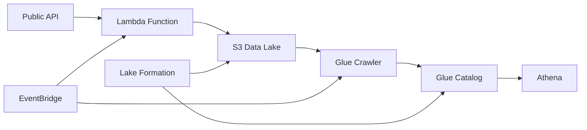

# 🚀 AWS Data Pipeline with CDK

A production-ready serverless data pipeline built with AWS CDK (Python) that extracts data from public APIs, stores it in S3, catalogs it with AWS Glue, and makes it queryable through Amazon Athena.

## 📋 Table of Contents

- [Architecture](#architecture)
- [Features](#features)
- [Prerequisites](#prerequisites)
- [Project Structure](#project-structure)
- [Installation](#installation)
- [Configuration](#configuration)
- [Deployment](#deployment)
- [Testing](#testing)
- [Usage](#usage)
- [Monitoring](#monitoring)
- [Security](#security)
- [Cost Optimization](#cost-optimization)
- [Troubleshooting](#troubleshooting)
- [CI/CD Pipeline](#cicd-pipeline)
- [API Documentation](#api-documentation)
- [Production Checklist](#production-checklist)
- [Contributing](#contributing)
- [License](#license)
- [Acknowledgments](#acknowledgments)
- [Support](#support)

## 🏗 Architecture


### Components

- **Lambda Function**: Extracts data from public APIs and writes to S3
- **S3 Buckets**: Data lake storage with lifecycle policies
- **Glue Crawler**: Automatically discovers and catalogs data
- **Glue Database**: Metadata catalog for structured data
- **Lake Formation**: Fine-grained access control and governance
- **Athena**: SQL queries on the data lake
- **EventBridge**: Scheduled triggers for automation

## ✨ Features

- **Serverless** and scalable
- **Multiple formats**: Parquet, JSON, CSV
- **Automated cataloging** (Glue Crawler)
- **Date partitioning** (year/month/day)
- **Security & governance** (LF + encryption)
- **Cost controls** (lifecycle, scan limits)
- **Monitoring** (CloudWatch + X-Ray)
- **Testing** (unit + integration)
- **CI/CD-friendly**

## 📦 Prerequisites

### Required Software

- Python 3.11+
- Node.js 16+ (for CDK)
- AWS CLI v2
- AWS CDK v2

### AWS Setup

```bash
aws configure
cdk bootstrap aws://ACCOUNT_ID/REGION
```

## 📁 Project Structure

```
data-pipeline-cdk/
├── infrastructure/          # CDK code
│   ├── stacks/              # Stacks
│   ├── constructs/          # Reusable constructs
│   └── config/              # Settings & constants
├── lambdas/                 # Lambda source
│   └── data_extractor/      # Extractor logic
├── tests/                   # Unit & integration tests
├── scripts/                 # Helper scripts
├── docs/                    # Extra docs
└── app.py                   # CDK app entry
```

## 🔧 Installation

### Quick Start (recommended)

```bash
git clone <repository-url>
cd data-pipeline-cdk
make install
make init-project
```

> **Note about Lambda dependencies:**  
> Lambda dependencies are bundled automatically during `cdk synth/deploy`. You don’t need (and shouldn’t) run `pip install -t` inside `lambdas/...` for deployment. Mixing local wheels with Lambda’s runtime can cause import errors. For local experiments only, you may install temporarily—outside the normal deploy flow.

### Manual (optional)

```bash
pip install -r requirements.txt
pip install -r requirements-dev.txt
pre-commit install
```

## ⚙️ Configuration

Create `.env` from `.env.example`:

```env
ENVIRONMENT=dev
REGION=us-east-1
ACCOUNT_ID=123456789012
PROJECT_NAME=data-pipeline
API_ENDPOINT=https://jsonplaceholder.typicode.com/users
OUTPUT_FORMAT=parquet
ENABLE_LAKE_FORMATION=true
```

For deeper tuning (Lambda timeout/memory, crawler schedule, etc.), see `infrastructure/config/settings.py`.

## 🚀 Deployment

### With Makefile

```bash
# Dev
make deploy ENVIRONMENT=dev

# Production with approval
make deploy-with-approval ENVIRONMENT=prod
```

### Step-by-step

```bash
cdk synth
cdk diff
cdk deploy --all
python scripts/test_pipeline_complete.py
```

**Typical outputs**: S3 buckets, Lambda ARN, Glue database, Athena workgroup.

## 🧪 Testing

```bash
# All tests
make test

# Unit only
make test-unit

# Integration only
make test-integration

# Coverage (HTML in htmlcov/)
pytest --cov=infrastructure --cov=lambdas --cov-report=html
```

Test the deployed environment:

```bash
python scripts/test_pipeline_complete.py
make trigger-lambda
make run-crawler
```

## 📊 Usage

### Invoke Lambda

```python
import boto3, json

lambda_client = boto3.client('lambda')
resp = lambda_client.invoke(
    FunctionName='data-pipeline-data-extractor',
    InvocationType='RequestResponse',
    Payload=json.dumps({"force_refresh": True})
)
```

### Query with Athena

```sql
SHOW TABLES IN data_pipeline_db;

SELECT *
FROM data_pipeline_db.data_pipeline_raw_data
WHERE year=2024 AND month=1
LIMIT 10;

SELECT COUNT(*) AS record_count, year, month
FROM data_pipeline_db.data_pipeline_raw_data
GROUP BY year, month
ORDER BY year DESC, month DESC;
```

### From Python (optional)

```python
import awswrangler as wr

df = wr.athena.read_sql_query(
    "SELECT * FROM data_pipeline_db.data_pipeline_raw_data LIMIT 100",
    database="data_pipeline_db"
)
```

## 📈 Monitoring

```bash
# Lambda logs (tail)
make logs
# or
aws logs tail /aws/lambda/data-pipeline-data-extractor --follow
```

Metrics to watch: Lambda invocations/errors, S3 size/requests, Glue crawler runs, Athena query performance.

**Example CloudWatch alarm for Lambda errors:**

```python
import boto3

cloudwatch = boto3.client('cloudwatch')
cloudwatch.put_metric_alarm(
    AlarmName='DataPipelineLambdaErrors',
    MetricName='Errors',
    Namespace='AWS/Lambda',
    Dimensions=[
        {'Name': 'FunctionName', 'Value': 'data-pipeline-data-extractor'}
    ],
    Statistic='Sum',
    Period=300,
    EvaluationPeriods=1,
    Threshold=1,
    ComparisonOperator='GreaterThanThreshold'
)
```

## 🔒 Security

Implemented:
- **SSE-S3** for buckets and Athena results
- **TLS** in transit
- **Least privilege** with IAM + Lake Formation
- **Public access block** on S3
- **LF tags** and auditing

Quick checklist:
- No hardcoded credentials
- Secrets in Secrets Manager
- Private endpoints (prod)
- CloudTrail / AWS Config / GuardDuty (prod)
- S3 versioning, MFA delete (prod)

## 💰 Cost Optimization

- **S3 lifecycle** (Standard → IA → Glacier)
- **Lambda** right-sized
- **Athena** partitioning + Parquet + scan limits
- Monitor with Cost Explorer

## 🔧 Troubleshooting

**Lambda Timeout**
```bash
# Increase timeout in settings.py and redeploy
```

**Crawler not finding data**
```bash
aws s3 ls s3://<bucket>/raw-data/ --recursive
aws glue get-crawler --name data_pipeline_crawler
```

**Athena query errors**
```sql
SHOW TABLES IN data_pipeline_db;
MSCK REPAIR TABLE data_pipeline_db.data_pipeline_raw_data;
```

**Lake Formation permission denied**
```bash
aws lakeformation grant-permissions   --principal DataLakePrincipalIdentifier=arn:aws:iam::ACCOUNT:role/ROLE   --permissions SELECT DESCRIBE   --resource '{"Table": {"DatabaseName": "data_pipeline_db", "Name": "data_pipeline_raw_data"}}'
```

**Debug**
```bash
export LOG_LEVEL=DEBUG
```

## 🚦 CI/CD Pipeline

```yaml
name: Deploy Data Pipeline

on:
  push:
    branches: [main, develop]

jobs:
  test:
    runs-on: ubuntu-latest
    steps:
      - uses: actions/checkout@v3
      - uses: actions/setup-python@v4
        with:
          python-version: '3.11'
      - run: make install
      - run: make test

  deploy:
    needs: test
    runs-on: ubuntu-latest
    if: github.ref == 'refs/heads/main'
    steps:
      - uses: actions/checkout@v3
      - uses: aws-actions/configure-aws-credentials@v2
        with:
          aws-access-key-id: ${{ secrets.AWS_ACCESS_KEY_ID }}
          aws-secret-access-key: ${{ secrets.AWS_SECRET_ACCESS_KEY }}
          aws-region: us-east-1
      - run: make deploy ENVIRONMENT=prod
```

## 📝 API Documentation

### Lambda Event

```json
{
  "force_refresh": false,
  "api_params": { "page": 1, "per_page": 100 }
}
```

### Lambda Response

```json
{
  "statusCode": 200,
  "body": {
    "message": "Data extraction completed successfully",
    "details": {
      "records_processed": 100,
      "s3_location": "s3://bucket/key",
      "format": "parquet",
      "request_id": "uuid"
    }
  }
}
```

## 🎯 Production Checklist

- [ ] MFA, CloudWatch alarms, AWS Config
- [ ] Backups / DR
- [ ] Cost alerts
- [ ] GuardDuty
- [ ] Runbooks
- [ ] Load tests

## 🤝 Contributing

```bash
git checkout -b feature/my-feature
make test && make lint
git commit -m "feat: add new feature"
git push origin feature/my-feature
```

## 📄 License

MIT

## 🙏 Acknowledgments

- AWS CDK Team
- Community
- Open-source libraries

## 📞 Support

- GitHub Issues
- Docs in `./docs`
- Email: elkin.giraldo.pinedo@gmail.com

---

**Built with ❤️ using AWS CDK and Python**
