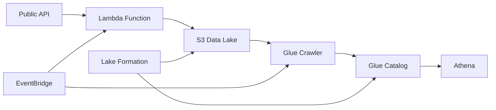

# 🚀 AWS Data Pipeline with CDK

A production-ready serverless data-pipeline built with AWS CDK in Python that extracts data from public APIs, stores it in S3, catalogs it with AWS Glue, and makes it queryable through Amazon Athena.

## 📋 Table of Contents

- [Architecture](#architecture)
- [Features](#features)
- [Prerequisites](#prerequisites)
- [Project Structure](#project-structure)
- [Installation](#installation)
- [Configuration](#configuration)
- [Deployment](#deployment)
- [Testing](#testing)
- [Usage](#usage)
- [Monitoring](#monitoring)
- [Security](#security)
- [Cost Optimization](#cost-optimization)
- [Troubleshooting](#troubleshooting)

## 🏗 Architecture



### Components

- **Lambda Function**: Extracts data from public APIs and writes to S3
- **S3 Buckets**: Data lake storage with lifecycle policies
- **Glue Crawler**: Automatically discovers and catalogs data
- **Glue Database**: Metadata catalog for structured data
- **Lake Formation**: Fine-grained access control and governance
- **Athena**: SQL queries on the data lake
- **EventBridge**: Scheduled triggers for automation

## ✨ Features

- **Serverless Architecture**: Fully managed, scalable infrastructure
- **Multiple Data Formats**: Support for Parquet, JSON, CSV
- **Automated Cataloging**: Glue Crawler discovers schema automatically
- **Data Partitioning**: Organized by year/month/day for efficient queries
- **Security & Governance**: Lake Formation permissions and encryption
- **Cost Optimization**: S3 lifecycle policies and Athena query limits
- **Monitoring**: CloudWatch metrics and X-Ray tracing
- **Testing**: Comprehensive unit and integration tests
- **CI/CD Ready**: Pre-commit hooks and GitHub Actions support

## 📦 Prerequisites

### Required Software

- Python 3.10+
- Node.js 16+ (for CDK)
- AWS CLI v2
- AWS CDK v2

### AWS Account Setup

1. AWS Account with appropriate permissions
2. AWS CLI configured with credentials
3. CDK bootstrapped in target region

```bash
# Configure AWS CLI
aws configure

# Bootstrap CDK
cdk bootstrap aws://ACCOUNT_ID/REGION
```

## 📁 Project Structure

```
data-pipeline-cdk/
├── infrastructure/         # CDK infrastructure code
│   ├── stacks/            # CDK stacks
│   ├── constructs/        # Reusable constructs
│   └── config/            # Configuration
├── lambda/                # Lambda function code
│   └── data_extractor/    # Data extraction logic
├── tests/                 # Test suites
│   ├── unit/             # Unit tests
│   └── integration/      # Integration tests
├── scripts/              # Utility scripts
├── docs/                 # Documentation
└── app.py               # CDK app entry point
```

## 🔧 Installation

### Quick Start

```bash
# Clone the repository
git clone <repository-url>
cd data-pipeline-cdk

# Install dependencies
make install

# Initialize project
make init-project
```

### Manual Installation

```bash
# Install Python dependencies
pip install -r requirements.txt
pip install -r requirements-dev.txt

# Install Lambda dependencies
cd lambda/data_extractor
pip install -r requirements.txt -t .
cd ../..

# Install pre-commit hooks
pre-commit install
```

## ⚙️ Configuration

### Environment Variables

Create a `.env` file based on `.env.example`:

```env
ENVIRONMENT=dev
AWS_REGION=us-east-1
AWS_ACCOUNT_ID=123456789012
PROJECT_NAME=data-pipeline
API_ENDPOINT=https://jsonplaceholder.typicode.com/users
OUTPUT_FORMAT=parquet
ENABLE_LAKE_FORMATION=true
```

### Customizing Settings

Edit `infrastructure/config/settings.py` to modify:

- Lambda timeout and memory
- S3 bucket names
- Crawler schedule
- Data formats
- API endpoints

## 🚀 Deployment

### Deploy Everything

```bash
# Deploy to dev environment
make deploy ENVIRONMENT=dev

# Deploy to production with approval
make deploy-with-approval ENVIRONMENT=prod
```

### Step-by-Step Deployment

```bash
# 1. Synthesize CloudFormation templates
cdk synth

# 2. Review changes
cdk diff

# 3. Deploy all stacks
cdk deploy --all

# 4. Test the deployment
python scripts/test_pipeline_complete.py
```

### Deployment Outputs

After deployment, you'll get:

- S3 bucket names
- Lambda function ARN
- Glue database name
- Athena workgroup name

## 🧪 Testing

### Run All Tests

```bash
make test
```

### Run Specific Tests

```bash
# Unit tests only
make test-unit

# Integration tests
make test-integration

# Test with coverage
pytest --cov=infrastructure --cov=lambda --cov-report=html
```

### Test the Deployed Pipeline

```bash
# Test all components
python scripts/test_pipeline_complete.py

# Manually trigger Lambda
make trigger-lambda

# Run Glue crawler
make run-crawler
```

## 📊 Usage

### Trigger Data Extraction

```python
import boto3

lambda_client = boto3.client('lambda')
response = lambda_client.invoke(
    FunctionName='data-pipeline-data-extractor',
    InvocationType='RequestResponse',
    Payload='{"force_refresh": true}'
)
```

### Query Data with Athena

```sql
-- Show available tables
SHOW TABLES IN data_pipeline_db;

-- Query extracted data
SELECT *
FROM data_pipeline_db.data_pipeline_raw_data
WHERE year = 2024
  AND month = 1
LIMIT 10;

-- Aggregate analysis
SELECT 
    COUNT(*) as record_count,
    year,
    month
FROM data_pipeline_db.data_pipeline_raw_data
GROUP BY year, month
ORDER BY year DESC, month DESC;
```

### Access via Python

```python
import boto3
import pandas as pd

# Using boto3
athena_client = boto3.client('athena')
s3_client = boto3.client('s3')

# Using awswrangler (recommended)
import awswrangler as wr

df = wr.athena.read_sql_query(
    "SELECT * FROM data_pipeline_db.data_pipeline_raw_data LIMIT 100",
    database="data_pipeline_db"
)
```

## 📈 Monitoring

### CloudWatch Metrics

- Lambda invocations and errors
- S3 bucket size and requests
- Glue crawler runs
- Athena query performance

### View Logs

```bash
# Lambda logs
make logs

# Or using AWS CLI
aws logs tail /aws/lambda/data-pipeline-data-extractor --follow
```

### Set Up Alarms

```python
# Example CloudWatch alarm for Lambda errors
cloudwatch = boto3.client('cloudwatch')
cloudwatch.put_metric_alarm(
    AlarmName='DataPipelineLambdaErrors',
    MetricName='Errors',
    Namespace='AWS/Lambda',
    Dimensions=[
        {'Name': 'FunctionName', 'Value': 'data-pipeline-data-extractor'}
    ],
    Statistic='Sum',
    Period=300,
    EvaluationPeriods=1,
    Threshold=1,
    ComparisonOperator='GreaterThanThreshold'
)
```

## 🔒 Security

### Best Practices Implemented

1. **Encryption at Rest**
    - S3 Server-Side Encryption (SSE-S3)
    - Encrypted Athena query results

2. **Encryption in Transit**
    - HTTPS only for S3 access
    - TLS for API calls

3. **Access Control**
    - IAM roles with least privilege
    - Lake Formation fine-grained permissions
    - S3 bucket policies blocking public access

4. **Data Governance**
    - Lake Formation tags for classification
    - Column-level access control
    - Audit logging enabled

### Security Checklist

- ✅ No hardcoded credentials
- ✅ Secrets in AWS Secrets Manager
- ✅ VPC endpoints for private access
- ✅ CloudTrail logging enabled
- ✅ S3 versioning enabled
- ✅ MFA delete protection (production)

## 💰 Cost Optimization

### Implemented Optimizations

1. **S3 Lifecycle Policies**
   ```
   0-30 days: Standard
   30-90 days: Infrequent Access
   90+ days: Glacier
   ```

2. **Lambda Configuration**
    - Right-sized memory allocation
    - Reserved concurrency limits
    - Provisioned concurrency for production

3. **Athena Query Optimization**
    - Data partitioning by date
    - Columnar format (Parquet)
    - Query result caching
    - Bytes scanned limit

### Cost Monitoring

```bash
# Get cost estimate
aws ce get-cost-and-usage \
    --time-period Start=2024-01-01,End=2024-01-31 \
    --granularity MONTHLY \
    --metrics "UnblendedCost" \
    --group-by Type=DIMENSION,Key=SERVICE
```

## 🔧 Troubleshooting

### Common Issues

#### Lambda Timeout
```bash
# Increase timeout in settings.py
LAMBDA_TIMEOUT = 900  # 15 minutes

# Redeploy
cdk deploy ComputeStack
```

#### Glue Crawler Not Finding Data
```bash
# Check S3 path
aws s3 ls s3://your-bucket/raw-data/ --recursive

# Check crawler configuration
aws glue get-crawler --name data_pipeline_crawler
```

#### Athena Query Errors
```sql
-- Check if table exists
SHOW TABLES IN data_pipeline_db;

-- Repair table partitions
MSCK REPAIR TABLE data_pipeline_db.data_pipeline_raw_data;
```

#### Lake Formation Permission Denied
```bash
# Grant permissions
aws lakeformation grant-permissions \
    --principal DataLakePrincipalIdentifier=arn:aws:iam::ACCOUNT:role/ROLE \
    --permissions SELECT DESCRIBE \
    --resource '{"Table": {"DatabaseName": "data_pipeline_db", "Name": "data_pipeline_raw_data"}}'
```

### Debug Mode

```python
# Enable debug logging
import logging
logging.basicConfig(level=logging.DEBUG)

# Set environment variable
export LOG_LEVEL=DEBUG
```

## 🚦 CI/CD Pipeline

### GitHub Actions Workflow

```yaml
name: Deploy Data Pipeline

on:
  push:
    branches: [main, develop]

jobs:
  test:
    runs-on: ubuntu-latest
    steps:
      - uses: actions/checkout@v3
      - uses: actions/setup-python@v4
        with:
          python-version: '3.11'
      - run: make install
      - run: make test

  deploy:
    needs: test
    runs-on: ubuntu-latest
    if: github.ref == 'refs/heads/main'
    steps:
      - uses: actions/checkout@v3
      - uses: aws-actions/configure-aws-credentials@v2
        with:
          aws-access-key-id: ${{ secrets.AWS_ACCESS_KEY_ID }}
          aws-secret-access-key: ${{ secrets.AWS_SECRET_ACCESS_KEY }}
          aws-region: us-east-1
      - run: make deploy ENVIRONMENT=prod
```

## 📝 API Documentation

### Lambda Event Schema

```json
{
  "force_refresh": false,
  "api_params": {
    "page": 1,
    "per_page": 100
  }
}
```

### Lambda Response Schema

```json
{
  "statusCode": 200,
  "body": {
    "message": "Data extraction completed successfully",
    "details": {
      "records_processed": 100,
      "s3_location": "s3://bucket/key",
      "format": "parquet",
      "request_id": "uuid"
    }
  }
}
```

## 🎯 Production Checklist

Before going to production:

- [ ] Enable MFA for AWS account
- [ ] Set up CloudWatch alarms
- [ ] Configure backup strategy
- [ ] Enable AWS Config rules
- [ ] Set up cost alerts
- [ ] Configure auto-scaling
- [ ] Enable GuardDuty
- [ ] Set up disaster recovery
- [ ] Document runbooks
- [ ] Load testing completed

## 🤝 Contributing

1. Fork the repository
2. Create a feature branch
3. Make your changes
4. Run tests and linting
5. Submit a pull request

### Development Workflow

```bash
# Create feature branch
git checkout -b feature/my-feature

# Make changes and test
make test
make lint

# Commit with conventional commits
git commit -m "feat: add new feature"

# Push and create PR
git push origin feature/my-feature
```

## 📄 License

This project is licensed under the MIT License - see the LICENSE file for details.

## 🙏 Acknowledgments

- AWS CDK Team for the excellent framework
- Community contributors
- Open source libraries used in this project

## 📞 Support

For issues and questions:
- GitHub Issues: [Create an issue](https://github.com/your-repo/issues)
- Documentation: [Read the docs](./docs)
- Email: support@example.com

---

## 🎉 Bonus: DataZone Integration (Manual Setup)

### Setting up DataZone

1. **Create DataZone Domain**
   ```bash
   aws datazone create-domain \
     --name "DataPipelineDomain" \
     --description "Domain for data pipeline"
   ```

2. **Create Project**
    - Navigate to DataZone console
    - Create new project
    - Add team members

3. **Create Environment**
    - Select the project
    - Create environment
    - Choose AWS Glue as data source

4. **Register Data Assets**
    - Add Glue database as data source
    - Create data assets from tables
    - Apply business metadata

5. **Set Up Data Catalog**
    - Define business glossary
    - Add data quality rules
    - Configure data lineage

### DataZone Benefits

- Business-friendly data catalog
- Self-service data discovery
- Automated data quality monitoring
- Collaboration features
- Data marketplace capabilities

---

**Built with ❤️ using AWS CDK and Python**